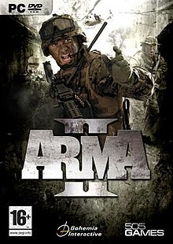
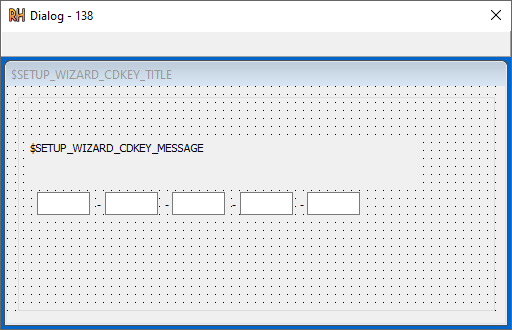
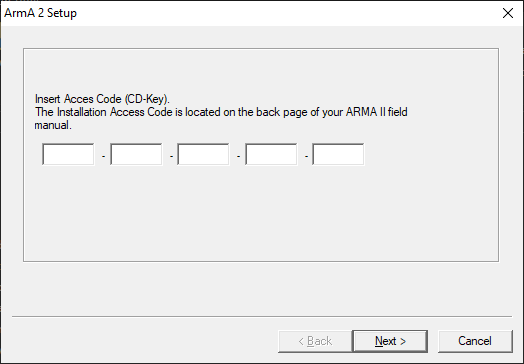
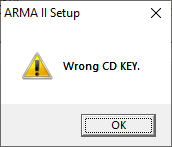

</img>

# ARMA II RE

```
VALID KEY: R20S-7BTR0-T0RER-33DTP-VKNBC

R20S7BTR0T0RER33DTPVKNBC
AAAABBBBBCCCCCDDDDDEEEEE
```
So, looking at the resources in the `Setup.exe` of the in the root of the ARMA II files gives us the dialog we're looking for:



Running the `.exe` confirms our suspicions. As it instantly asks for the key:



We also have an error message pop-up:



We can use strings in these pop-ups to hopefully find the area we should begin looking in.

## Ghidra

After following the logic flow to the "Wrong CD KEY." message, I get to a function where the key is check and concatenated. It is passed into a function and its result determines if the error message is displayed.

Below is some extracted pseudo code:


TODO:
```python
KEY_VAR = "KEY_STRING"
result = key_check_logic(KEY_VAR)

showErrorMsg = (showErrorMsg & 0xffffff00 | (result == 0))

```

### FUN_004022e0

Initial conversion of similar looking chars

```python
c = _toupper(c)

# O --> 0
if c == 0x4f:
    c = 0x30

# I --> 1
elif c == 0x49:
    c = 0x31
```

It then checks if the input has the correct characters. It looks in the following list:

```
0123456789ABCDEFGHJKLMNPRSTVWXYZ
```

It then performs operations on each of the characters in the group:

```
1. Finds position of char in above list
2. Runs allsh1() [ON WHAT?]
3. ORs EBX and [counter?]
4. ORs and shifts >> 0x20
```

The function then returns:

```
return [counter?] & 0xffffff00;
```


The program then loops around 8 chars in the input three times.

This essentially splits the input into 3 groups of 8

