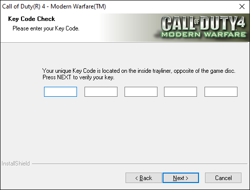
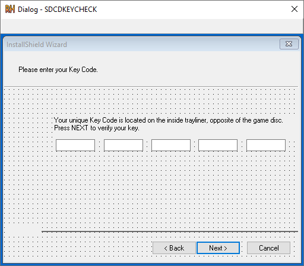

</img>

# COD 4

## Recon

COD uses `InstallShield` to package and manage this installation of the game.

Running through the process gives us a window like so:



Looking at the resources of `setup.exe` does not show us any sign that the logic is contain within.

Using process hacker we can see that the `setup.exe` spawns a child process.

<!-- <TODO: Image here> -->

We can navigate to the file location where `setup.exe` unpacked all the resources.

We see something like so:


These are all the assets and `.dlls` used in the installation process!

After a bit of trial and error the file: `_isuser.dll` contains the dialog we're after!



However no strings? Even when `grep`ing for them?

## InstallerShield

After doing some research it became apparent that the key verification logic will be handled by an internal "InstallerShield" script.

Within our directory of files we found earlier is a `setup.inx`, this is a compiled InstallShield script and will most likely contain the key verification logic.

Using the work of others it is possible to get somewhat readable code from this file.

The decompiler user was [SID](https://github.com/tylerapplebaum/setupinxhacking), this lets us view the reversed code!

But before we do that the `Setup.inx` requires decryption, the same author also provides a decryption script.

The code is displayed below:

```c
#include <stdio.h>
#include <fcntl.h>
#include <io.h>
#define XOR_VAL 0xF1

void main (void) 
{
  int i, c;
  unsigned char b;
  // Set "stdin" and "stdout" to have binary mode
  setmode (_fileno (stdin), _O_BINARY);
  setmode (_fileno (stdout), _O_BINARY);
  // Decrypt INX
  for (i = 0; (c = getchar ()) != EOF; i++) 
  {
    c ^= XOR_VAL;
    b = (unsigned char)((c >> 2) | (c << 6)) - (i % 71);
    putchar (b);
  }
}
```

This then lets us chuck the 'decrypted' `.inx` file into `SID`. The file can be found in the RE files under `Setup_dec.inx` and the code in `Setup.rul`

## Setup.inx

Could of key elements to note:

- Function called `CDKeyCheck`

`global_string4`
```
function_664(local_string3, "InstallDrive", 1, global_string4, local_number2);
```

`CDKeyCheck`
```
function BOOL CDKeyCheck(local_string1, local_string2)
           NUMBER local_number1, local_number2, local_number3; 
           STRING local_string3; 

    begin
       function_373(-2);
       local_number1 = LASTRESULT;
       local_string3 = (global_string4 ^ "Setup\\rsrc");
       function_517(local_string3);
       UseDll(local_string1);
       local_number3 = LASTRESULT;
       local_number3 = (local_number3 < 0);
       if(local_number3) then // ref index: 1
          local_string3 = (local_string1 + " failed to load!");
          function_632(local_string3, -65534);
          // return coming
          return 0;
          goto label_100b7;
       endif;
    label_ffe3:
       GetCDKey(local_number1, local_string2); // dll: CHECK.dll
       local_number2 = LASTRESULT;
       local_number3 = (local_number2 = 0);
       if(local_number3) then // ref index: 1
          function_605("USERDEF_INVALID_CD_KEY");
          local_string3 = LASTRESULT;
          function_632(local_string3, -65533);
          abort;
       endif;
    label_10051:
       UnUseDll(local_string1);
       local_number3 = LASTRESULT;
       local_number3 = (local_number3 < 0);
       if(local_number3) then // ref index: 1
          local_string3 = (local_string1 + " failed to load!");
          function_632(local_string3, -65534);
          // return coming
          return 0;
       endif;
    label_100b7:
       // return coming
       return local_number2;
    end; // checksum: 71a4093c
```

## Validate CD Key

`ValidateCDKey`
```
function BOOL ValidateCDKey(local_string1)
      NUMBER local_number1, local_number2, local_number3, local_number4, local_number5, local_number6, local_number7, local_number8; 
   begin
      StrLength(local_string1);
      local_number2 = LASTRESULT;
      local_number6 = (local_number2 != 20);
      if(local_number6) then // ref index: 1
         // return coming
         return 0;
      endif;
   label_102ee:
      local_number4 = 16;
      local_number3 = 0;
      local_number6 = (local_number4 - 1);
   label_10317:
      local_number7 = (local_number3 <= local_number6);
      if(local_number7) then // ref index: 20
         local_number1 = local_string1[local_number3];
         local_number7 = (local_number1 >= 97);
         local_number8 = (local_number1 <= 65);
         local_number7 = (local_number7 = local_number8);
         if(local_number7) then // ref index: 1
            local_number1 = (local_number1 - 32);
         endif;
   label_10385:
         // switch/while/???
   label_1038b:
         local_number7 = (local_number1 = 50);
         if(local_number7) then // ref index: 1
            local_number5 = 1;
            goto label_106ba;
         endif;
   label_103bd:
         local_number7 = (local_number1 = 52);
         if(local_number7) then // ref index: 1
            local_number5 = 1;
            goto label_106ba;
         endif;
   label_103ef:
         local_number7 = (local_number1 = 56);
         if(local_number7) then // ref index: 1
            local_number5 = 1;
            goto label_106ba;
         endif;
   label_10421:
         local_number7 = (local_number1 = 68);
         if(local_number7) then // ref index: 1
            local_number5 = 1;
            goto label_106ba;
         endif;
   label_10453:
         local_number7 = (local_number1 = 69);
         if(local_number7) then // ref index: 1
            local_number5 = 1;
            goto label_106ba;
         endif;
   label_10485:
         local_number7 = (local_number1 = 71);
         if(local_number7) then // ref index: 1
            local_number5 = 1;
            goto label_106ba;
         endif;
   label_104b7:
         local_number7 = (local_number1 = 74);
         if(local_number7) then // ref index: 1
            local_number5 = 1;
            goto label_106ba;
         endif;
   label_104e9:
         local_number7 = (local_number1 = 76);
         if(local_number7) then // ref index: 1
            local_number5 = 1;
            goto label_106ba;
         endif;
   label_1051b:
         local_number7 = (local_number1 = 77);
         if(local_number7) then // ref index: 1
            local_number5 = 1;
            goto label_106ba;
         endif;
   label_1054d:
         local_number7 = (local_number1 = 80);
         if(local_number7) then // ref index: 1
            local_number5 = 1;
            goto label_106ba;
         endif;
   label_1057f:
         local_number7 = (local_number1 = 81);
         if(local_number7) then // ref index: 1
            local_number5 = 1;
            goto label_106ba;
         endif;
   label_105b1:
         local_number7 = (local_number1 = 83);
         if(local_number7) then // ref index: 1
            local_number5 = 1;
            goto label_106ba;
         endif;
   label_105e3:
         local_number7 = (local_number1 = 84);
         if(local_number7) then // ref index: 1
            local_number5 = 1;
            goto label_106ba;
         endif;
   label_10615:
         local_number7 = (local_number1 = 85);
         if(local_number7) then // ref index: 1
            local_number5 = 1;
            goto label_106ba;
         endif;
   label_10647:
         local_number7 = (local_number1 = 87);
         if(local_number7) then // ref index: 1
            local_number5 = 1;
            goto label_106ba;
         endif;
   label_10679:
         local_number7 = (local_number1 = 89);
         if(local_number7) then // ref index: 1
            local_number5 = 1;
            goto label_106ba;
         endif;
   label_106ab:
         // return coming
         return 0;
   label_106ba:
         local_number3 = (local_number3 + 1);
         goto label_10317;
      endif;
   label_106d4:
      // return coming
      return local_number5;
   end; // checksum: fffca0d6
```

Seems to check the length of the key against 20

Converts any lowercase letters to upper case

Then loops around each character and checks it against the alphabet of

```
248DEGJLMPQSTUWY
```

One important thing to note is the fact that this alphabet check is only peformed on the first 16 characters. For some reason the final set of 4 are not checked??

## Verify CD Key

Seems to just append all the params into some monster string?

Maybe this appends all character chunks together?

`VerifyCDKey5`
```
function BOOL VerifyCDKey5(local_string1, local_string2, local_string3, local_string4, local_string5)

STRING local_string9; 

begin
   local_string9 = (local_string1 + local_string2);
   local_string9 = (local_string9 + local_string3);
   local_string9 = (local_string9 + local_string4);
   local_string9 = (local_string9 + local_string5);
   VerifyCDKey(local_string9);
   return;
end; // checksum: 2c4d317b
```

`VerifyCDKey`
```
function BOOL VerifyCDKey(local_string1)
   NUMBER local_number1, local_number2, local_number3, local_number4, local_number5; 
   STRING local_string2, local_string3, local_string4; 

begin
   local_number1 = 0;
   local_number2 = 0;
   local_string2 = local_string1;

   // Gets some CRC??
   local_number4 = GetCRC(local_string2);

   // TODO: Then it does something with the CRC??
   //       4 hex values mean its a CRC32? 
   // Maybe this converts a number to string?
   function_815(local_string4, "%4x", local_number4);
   local_number3 = 0;
label_107a3:

   // `local_number3` is a counter
   local_number4 = (local_number3 <= 4);
   if(local_number4) then // ref index: 2

      // Grabs character from CRC string
      local_number4 = local_string4[local_number3];

      // If the char is a space it is converted into a 0
      local_number4 = (local_number4 = 32);
      if(local_number4) then // ref index: 1
         local_string4[local_number3] = 48;
      endif;
label_107f7:

      // For some reason it is copying the entire CRC string into another
      // array
      local_number4 = local_string4[local_number3];
      local_string3[local_number3] = local_number4;
      local_number3 = (local_number3 + 1);
      goto label_107a3;
   endif;
label_1082b:
   local_string3[local_number3] = 0;

   // TODO: What you do?
   //    It is taking the same variable twice?
   function_811(local_string3, local_string3);

   local_number3 = 0;
label_10854:

   // Another loop
   local_number4 = (local_number3 <= 4);
   if(local_number4) then // ref index: 2

      // Grabs a char from the CRC
      local_number4 = local_string3[local_number3];

      // This seems to be a index for the final 
      // block of chars 16 --> 20
      local_number5 = (16 + local_number3);

      // This makes me believe `local_string2` is the
      // key str
      local_number5 = local_string2[local_number5];

      // It literally checks it against the CRC value :|
      
      local_number4 = (local_number4 != local_number5);
      if(local_number4) then // ref index: 1
         local_number2 = 1;
      endif;
label_108bf:
      local_number3 = (local_number3 + 1);
      goto label_10854;
   endif;
label_108d9:
   ValidateCDKey(local_string2);
   local_number4 = LASTRESULT;
   local_number5 = (local_number2 != 1);
   local_number4 = (local_number4 = local_number5);
   if(local_number4) then // ref index: 1
      // return coming
      return 1;
      goto label_1093b;
   endif;
label_1092c:
   // return coming
   return 0;
label_1093b:
end; // checksum: f20ee05
```


CRC
```
function NUMBER GetCRC(local_string1)
           NUMBER local_number1, local_number2, local_number3, local_number4, local_number5, local_number6, local_number8, local_number9; 
           STRING local_string2, local_string3; 
begin
   local_number1 = 0;
   local_number3 = 0;
   local_number4 = 40961;
   local_number6 = 0;
   local_number1 = local_number3;
   local_number5 = 0;
label_10121:
   local_number9 = (local_number5 <= 15);
   if(local_number9) then // ref index: 1
      local_number9 = local_string1[local_number5];
      local_string2[local_number5] = local_number9;
      local_number5 = (local_number5 + 1);
      goto label_10121;
   endif;
label_10170:
   local_string2[local_number5] = 0;
label_10181:
   // switch/while/???
   local_number9 = local_string2[local_number6];
   local_number9 = (local_number9 != 0);
   if(local_number9) then // ref index: 5
      StrSub(local_string3, local_string2, local_number6, 1);
      local_number6 = (local_number6 + 1);
      function_818(local_string3);
      local_number8 = LASTRESULT;
      local_number1 = (local_number1 ^ local_number8);
      local_number5 = 8;
label_101fc:
      local_number9 = (local_number5 >= 1);
      if(local_number9) then // ref index: 3
         local_number9 = (local_number1 & 1);
         if(local_number9) then // ref index: 1
            local_number2 = (local_number1 >> 1);
            local_number1 = (local_number2 ^ local_number4);
            goto label_1026a;
         endif;
label_10259:
         local_number1 = (local_number1 >> 1);
label_1026a:
         local_number5 = (local_number5 - 1);
         goto label_101fc;
      endif;
label_10284:
      goto label_10181;
   endif;
label_1028f:
   // return coming
   return local_number1;
end; // checksum: a3c912
```