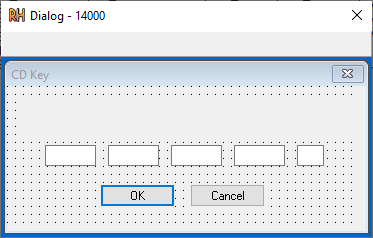
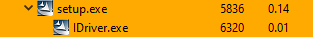
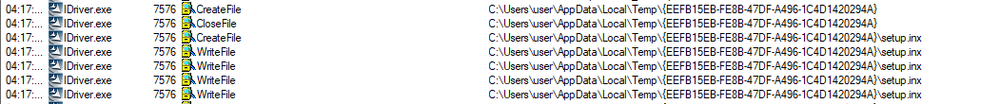
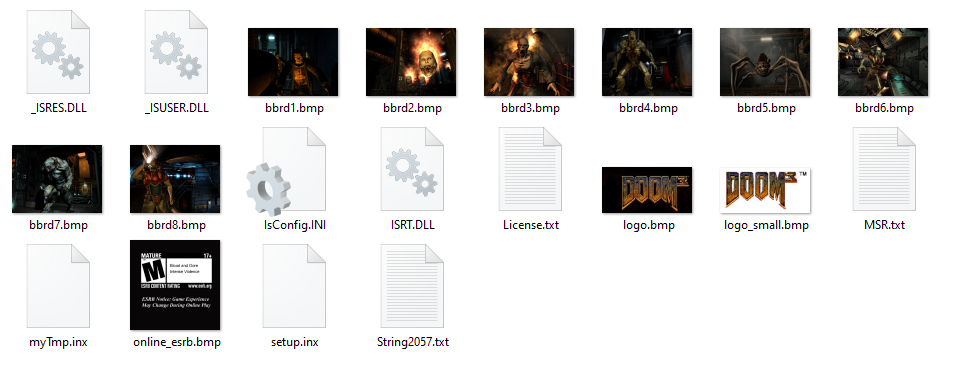
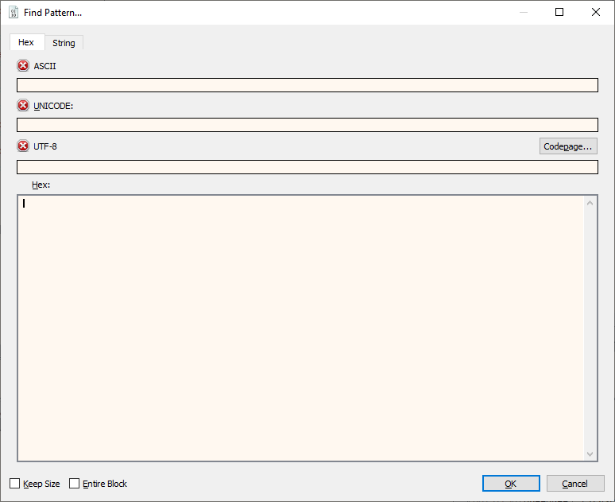
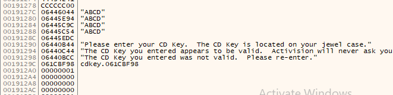
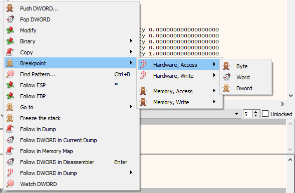

</img>

# DOOM 3

## Recon

Immediately it was apparently where the CD key validation was taking place - the directory `/Setup/rsrc/` contains a file called `cdkey.dll`.

Opening this file in `ResourceHacker` shows us the key entry dialog



This tells us the key input and validation is contained within the `.dll`. 

## InstallerShield

As pervious experience has shown an InstallerShield `.exe` will extract all its resources to a temporary directory. This should contain an `.inx` file that contains the setup logic. This is useful because we can see how the `cdkey.dll` is used.

Looking at `setup.exe` in ProcessHacker we can see when it runs it spawns another process `IDriver.exe`.



`IDriver.exe` will create a temp directory and write all the setup files there. We can see the file path using Procmon:



Navigating to this directory gives us all of the setup files!



## Cdkey.dll

Decoding the `setup.inx` file can be achieved using [SID](https://github.com/tylerapplebaum/setupinxhacking).

Once we've decoded the `setup.inx` file we can see in the code below that the `cdkey.dll` is used to validate the entered key.
```
label_a9a0:
@0000AA09:0039      UseDll("cdkey.dll");
@0000AA19:0020      GetCDKey(global_string32, local_number11); // dll: cdkey.dll
@0000AA25:0006      local_number8 = LASTRESULT;
@0000AA2F:000D      local_number14 = (local_number8 = 0);
@0000AA3E:0004      if(local_number14) then // ref index: 1
@0000AA4A:0021         function_553("USERDEF_INVALID_CD_KEY");
@0000AA69:0006         local_string12 = LASTRESULT;
@0000AA73:0021         function_579(local_string12, -65533);
@0000AA81:0002         abort;
@0000AA85:0005      endif;
```

Now this should be easy, right? The `GetCDKey` should take user input, validate the key and return a result. However, this does not seem to be the case. Maybe this is due to incomplete decompilation but `GetCDKey` does not seem to interface with the validation code. 

Therefore, in order to find the validation code I had to use another technique.

In `x64dbg` you can search memory for certain patterns, this means I can put in a unique key and search for it in memory.

Searching memory can be performed like so:



This leads us to the memory locations:




This is important because we can set an "Access breakpoint" on these memory locations



This will stop the debugger everytime the memory is accessed. This should lead us to the validation logic.

After some trial and error I get taken to the `FUN_10001fd0` this seems to be performing the key validation!

## FUN_10001fd0

The function begins by concatenating the key sections (Four groups of four bytes) with a single pair appended to the end.

This can be seen in the Ghidra psuedocode below:

```C
strcpy(local_8 + 0x17, local_8 + 0x1c);
strcat(local_8 + 0x17, local_8 + 0x1d);
strcat(local_8 + 0x17, local_8 + 0x1e);
strcat(local_8 + 0x17, local_8 + 0x1f);
```

The final two characters are copied into a local variable

```C
strcpy(final_chunk, local_8 + 0x20);
```

The program checks if the 16 character and 2 character sections are present.

```C
sVar2 = strlen(local_8 + 0x17);
if (sVar2 == 0x10) {

    sVar2 = strlen(final_chunk);
    if (sVar2 == 2) {
...
```

The validation occurs in this block:

```C
local_14 = FUN_100015f0((byte *)(local_8 + 0x17),0x10);

local_18 =  local_14 & 0xff ^ 
            (local_14 & 0xff00) >> 8 ^ 
            (local_14 & 0xff0000) >> 0x10 ^ 
            local_14 >> 0x18;

local_10 = FUN_10004260(local_18, "%02X");
iVar4 = _strcmp(final_chunk,local_10);
```

`FUN_100015f0` is essentially a checksum function. It performs some operations on the key. It takes the key and it's length as inputs.

The best way to display how it performs its checksum is through some nice Python code:

```python
def FUN_100015f0(key):
    checksum = 0xffffffff

    for i in range(16):
        index = (checksum ^ ord(key[i])) & 0xff
        checksum = int(BIG_ARRAY[index], 16) ^ (checksum >> 8)

    return checksum ^ 0xffffffff
```

The `BIG_ARRAY` variables is some arbitrary four byte values hardcoded into memory.


The value produced from `FUN_100015f0` is then altered slightly to produce us a `target_byte`.

The four byte output has each of its bytes XORed together. For example:

The value:
```
BB04570B
```

Will produce the `target_byte` like so:
```
target_byte = 0xBB ^ 0x04 ^ 0x57 ^ 0x0B
```

We check the final two character value against this `target_byte` to check if the key is valid!

## Keygen time

Now, its probably quite obvious how to break this, but I'll describe it here for completion.

All we have to do is generate 16 random values (`[A-Z]|[0-9]`) run them through  `FUN_100015f0` to get the checksum value that then has its values individually XORed.

This gives us the value the program is looking for, we just append this value onto the random 16 values we created earlier to create a valid key!

## Titbits

### Shall we just skip the key?
Running the installer as 

```
./setup.exe /a
```

Skips the key menu!

You can also just run the `doom3.exe` to start the post-key setup.

### Strange keys

Now unlike other key validation algorithms DOOM 3 does not have any alphabet restrictions!

Therefore, we can actually use symbols as the program just converts them into a single byte. This means as long as the input box doesn't strip them (sorry whitespace) we can use it as a key value.

This allows us to make some funky valid keys such as:

```
////-////-////-////-8C
????-????-????-????-2F
©©©©-©©©©-©©©©-©©©©-7C
§§§§-§§§§-§§§§-§§§§-DA
```

