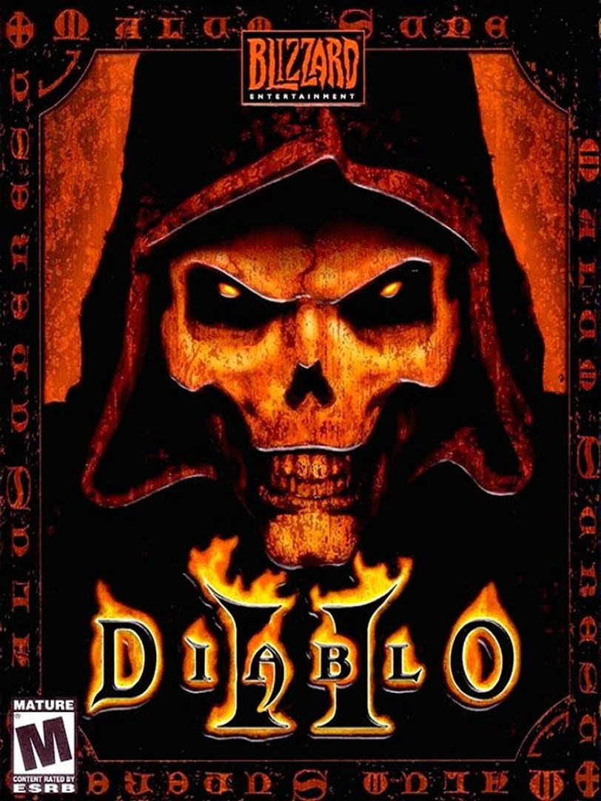
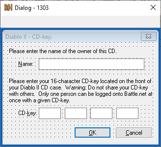
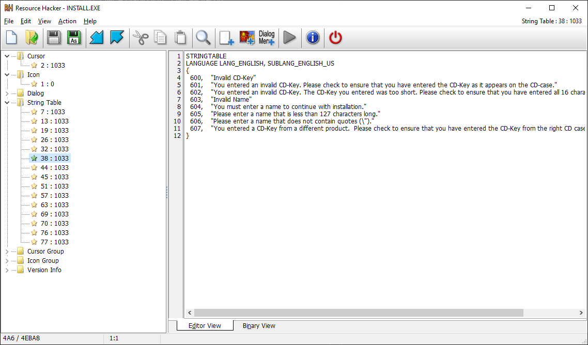
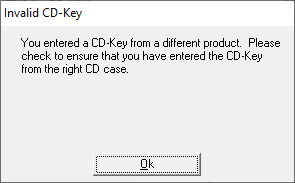

# Diablo II RE



# Recon

Using our good friend Resource Hacker, we can instantly see a dialog menu structured in a very familiar way:



This output can be used to find some juicy strings we can use to find the start of the key verification logic.



As the strings are not stored inline, we can use the numerical values attached to the strings above to see where these are used.

This leads us to the following logic:

# Name validation

Using the value `603` (`"Invalid Name"`) from ResourceHacker. This takes us to a couple of areas when the value is being pushed to the stack as a call param for `FUN_00402dd0`.

`FUN_00402dd0` can be abstracted as a "resource" loading function.

The following code has been adapted from Ghidra output:

```C
int VALIDATE_NAME_INPUT(char* *NAME_STR, HWND RESC_PTR)
{
  if (NAME_STR == 0x0) {
    THROW_ERROR(0x57);
    return 0;
  }
  uint strLen = lstrlenA(NAME_STR);
  if (strLen == 0) {
                    /* DISPLAYS: "You must enter a name to continue with installation." */
    LOAD_RESOURCE(0x25b,0x25c,RESC_PTR);
    return 0;
  }
  if (0x1f < strLen) {
                    /* DISPLAYS: "Please enter a name that is less than 127 characters long." */
    LOAD_RESOURCE(0x25b,0x25d,RESC_PTR);
    return 0;
  }
  if (CONTAINS(NAME_STR,'\"') != 0x0) {
                    /* DISPLAYS: "Please enter a name that does not contain quotes (\")." */
    LOAD_RESOURCE(0x25b,0x25e,RESC_PTR);
    return 0;
  }
  return 1;
}
```

```
Where: 

LOAD_RESOURCE   == FUN_00402dd0
CONTAINS        == FUN_00422a80
THROW_ERROR     == FUN_0041696a
```

This validation is very standard, we cannot have a string longer than 127 and it must not contain a quote mark.

# Key Validation Location

Now compared to Starcraft, the serial key has had a bit of an upgrade. It has been extended to 16 characters as the key now includes characters as well as numbers.

An example key can be seen below:

```
42G2-MG6B-DHEE-RBR6
```

## Alphabet validation

The first stop along the way is function `FUN_004146A0`. 
This function essentially checks if each character in the entered key are in an allowed set. However, it goes about it in an interesting but obscured way.

Some Ghidra code can be seen below:

```c
undefined4 CHECK_ALPHABET(byte *KEY_STR)
{
  byte bVar1;
  uint in_EAX;
  uint uVar2;
  
  bVar1 = *KEY_STR;
  uVar2 = in_EAX & 0xffffff00 | (uint)bVar1;
  while( true ) {
    if (bVar1 == 0) {
      return 1;
    }
    KEY_STR = KEY_STR + 1;
    uVar2 = &DAT_0043f750[uVar2 & 0xff];
    if (0x17 < uVar2) break;
    bVar1 = *KEY_STR;
    uVar2 = uVar2 & 0xffffff00 | (uint)bVar1;
  }
  return 0;
}
```

The code might seem a little all over the place. It has intentionally been made more dense on purpose.

All that really is important is the following lines:

```c
uVar2 = &DAT_0043f750[uVar2 & 0xff];
if (0x17 < uVar2) break;
```

The character value in `uVar2` is used as an index for the `DAT_0043f750` value.

Looking in `DAT_0043f750` we get the following dump of `0xFF` bytes:

```
0043F750  FF FF FF FF FF FF FF FF FF FF FF FF FF FF FF FF
0043F760  FF FF FF FF FF FF FF FF FF FF FF FF FF FF FF FF
0043F770  FF FF FF FF FF FF FF FF FF FF FF FF FF FF FF FF
0043F780  FF FF 00 FF 01 FF 02 03 04 05 FF FF FF FF FF FF
0043F790  FF FF 06 07 08 09 0A 0B 0C FF 0D 0E FF 0F 10 FF
0043F7A0  11 FF 12 FF 13 FF 14 15 16 FF 17 FF FF FF FF FF
0043F7B0  FF FF 06 07 08 09 0A 0B 0C FF 0D 0E FF 0F 10 FF
0043F7C0  11 FF 12 FF 13 FF 14 15 16 FF 17 FF FF FF FF FF
0043F7D0  FF FF FF FF FF FF FF FF FF FF FF FF FF FF FF FF
0043F7E0  FF FF FF FF FF FF FF FF FF FF FF FF FF FF FF FF
0043F7F0  FF FF FF FF FF FF FF FF FF FF FF FF FF FF FF FF
0043F800  FF FF FF FF FF FF FF FF FF FF FF FF FF FF FF FF
0043F810  FF FF FF FF FF FF FF FF FF FF FF FF FF FF FF FF
0043F820  FF FF FF FF FF FF FF FF FF FF FF FF FF FF FF FF
0043F830  FF FF FF FF FF FF FF FF FF FF FF FF FF FF FF FF
0043F840  FF FF FF FF FF FF FF FF FF FF FF FF FF FF FF FF
```

What is interesting is we have mostly `0xFF`s with a couple of values `0x00 --> 0x17` dotted around.

This is where the second line comes into play:
```C
if (0x17 < uVar2) break;
```

It uses the character's value as a index and checks what is returned from the chunky array.

If the returned value is greater than `0x17` (i.e. is `0xFF`) the loop breaks and the program returns an invalid status value.

So, for example the character `'A' == '0x41'`, gives us the memory location `0x43F791`. This memory location returns `0xFF`, resulting in an invalid character.

Doing this for all values and checking what returns a non `0xFF` value gives us the following alphabet:

```
246789BCDEFGHJKMNPRTVWXZbcdefghjkmnprtvwxz
```

This is an interesting way to hide a check for a valid alphabet.

## Key Validation

After the key passes the alphabet check, the key gets passed to the main validation logic.

This stage can be split into two important sections:

    - Key 'hash'
    - Checksum byte generation

### Key 'hash'

The hashing is actually quite simple. The program loops around the keys in pairs, obtains their values from the alphabet check array (`DAT_0043f750`) and places them in the following calculation:

```
x = MAP1 + MAP2 * 0x18
```

This result is then saved as a two digit hex value in place of the original pair.

For example with a two character example:

```
26 --> 02
```

```
Process:
'2' == 0x00
'6' == 0x02

x = 0x02 + 0x00 * 0x18
x = 0x02
```

Referring to this as 'hashing' is obviously absurd as this is trivially reversible, the result is used like a hash so *shrug*.

### Checksum byte generation

Alongside the 'hashing' operation another check is also occurring. 

Some python code of the overall operation is below: 

```python
# hash
x = map1 + map2 * 0x18

if (0xff < x):
    x -= 0x100

    verification_byte |= y

y = y << 1
```

So, if the value of `x` is higher than `0xff` we perform some operation on the variable `verification_byte`. Then we remove `0x100` from the value (Note this as it will be crucial later).

Now, after some time it was observed that the `verification_byte` is being used a flag variable.  The computation `y = y << 1` is the giveaway line, it progressively creates a binary value with more right hand zeros

```
e.g
1
10
100
1000
```

This is then ORed against the `verification_byte` thus, marking the index of a pair that was above `0xFF`. This byte is 8-bits in size, thus, being able to allocate a bit per pair.

For example if the 2nd and 6th pair are above `0xFF` the value `y` will be `10` and `100000` respectively. Giving us the binary value

```
00000000
00000010 OR  (2nd)
00100000 OR  (6th)
   ==
00100010
```

Or
```
0x22
```
This byte is used when checking in the next stage.

## Checksum

We're getting there - this is the final key validation step.

This step is exactly the same as the overall key validation included in Starcraft. 

The code will probably speak for itself:

```python
cs = 3

for k in key:
    cs = cs + (int(k, 16) ^ cs * 2)

return cs
```

All it does is create a single byte checksum for the hashed key created in the previous section. 

It does its job, the order of the characters matter and it is not clear how to fix it to give an expected value. Therefore, when exploiting we will leave this section alone.

The value produced from this is ANDed with `0xFF` (produces a single byte). This is then compared to the `verification_byte` generated earlier.

**If they match, we have a valid key!**

# How do we break it?

Now the exploit for the key gen here revolves around that `validation_byte` generation logic. Lets call the pairs that add a `1` bit to the `validation_byte` flag value (` > 0xFF`), **overflow pairs**.

I start by generating a random hashed version of some key. Later we'll go backwards from this and find a key that could make this hash, but first we need to do a little calculation.

I then run the hashed version of the key through the checksum function to work out what byte is required to pass the check. (Lets say `0xA1` for the purpose of argument)

This value: `0xA1` is `10100001` in binary. Jumping back to our `validation_byte` generation logic, this means that the 1st, 6th and 8th pairs need to be greater than `0xFF` for us to generate a correct key.

This is where I will work backwards from this hash. I work through all valid characters until I find two characters that create the hashed pair, if they're in a position that was found from the `validation_byte` I add `0x100` to it (See the **Checksum byte generation** section) to create us an overflow pair in the correct location! This changes the value of the `validation_byte` without changing the checksum value. The checksum value is unaltered due to the subtraction of `0x100` before the checksum is calculated.

This addition of `0x100` is the key operation, this will create us a key that generates the same checksum byte but a different `validation_byte` value. If we place the overflow pairs correctly we can get these values to match and have a valid key!

This lets us create valid keys!

Entering a generated key gives us this pop-up:



This is strange lets investigate???

# Other game check

Now, something I missed from the initial set of strings was the following:

```
"You entered a CD-Key from a different product. Please check to ensure that you have entered the CD-Key from the right CD case."
```

Blizzard seems to be performing the same validation check on all their keys but embedding something that can be used to distinguish.

The logic in question starts at `0x004148C0`

Where it proceeds to run the same validation checks again:
- Checks the alphabet
- Creates an hash key and verification byte
- Validates key

This happens up till line `0041496c`

## Shuffle

The algorithm then hashes the key again. This hash is then shuffled. This begins at `0041496c` with a loop between `00414973` --> `0041498c` that contains the majority of the logic.

Some examples are below:
```
D31B9CB02B2512B7 --> CBD31B9B2512B702
18087336CCE1B6B2 --> 3318087CE1B6B26C
```

After some close inspection it can be seen that all the program is doing is taking two pairs and moving them to either ends:
```
D31B9 CB02 B2512B7 --> CB D31B9B2512B7 02
18087 336C CE1B6B2 --> 33 18087CE1B6B2 6C
```

The python code is displayed below:

```python
def shuffle_key(key):
    key = list(key)

    i = 0xf
    while True:

        temp = key[i]

        newIndex = i + 1 + 0x16 & 0xf

        key[i] = key[newIndex]
        key[newIndex] = temp

        i -= 1
        if i < 0:
            break

    return "".join(key)
```

## Key decode

The program then runs around a similar loop before loading a magic constant `0x13ac9741` into a variable

The program loops through the key from right to left and alters the entire key

This is the final step before 2 bytes are copied from this key into a return variable. Other bytes are written out but the front two are relevant for this code section.

These front two bytes are used to determine if the key is from Diablo II and not another Blizzard game. 

We're looking for the front two values to equal either `06` or `07`.

Some C-Ghida-hybrid code is displayed below:

```C
i = 0xf;
magicValue = 0x13ac9741

do {
    key[i] = TO_UPPER(key[i]);;
    
    if (key[i] < '8') {
        key[i] = magicValue & 7 ^ key[i];
        magicValue = (magicValue >> 3);
    }
    else {
        if (key[i] < 'A') {
            key[i] = i & 1 ^ key[i];
        }
    }
    i = i + -1;
} while (-1 < i);
```

This essentially has three branches (Note all values here will have been checked to ensure they are a member of the valid set. See above for details):

1. ✔️ If the value is smaller than `'8'` i.e (`'0', '1', '2', '3', '4', '5', '6', '7'`) 

    - The magic value here is altered (`>> 3`) and XORed against the character (`& 7`). This is important and will be discussed below.

 2. ❌ If the value is bigger than or equal to `'8'` but smaller than `'A'` (`'8'` and `'9'`)

    - This does not seem to be important for our exploitation, might be useful for other key formats?

3.  ❌ Or if the value is `'A' --> 'Z'` 

    - Again, the program leaving these values alone is not worth considering as it does not affect us.


## Magic value

The magic value embedded in the code is a constant `0x13ac9741`. At first glance the value looks completely random, however after observing how it is used we can decode it into something more readable.

The key code section is displayed below:

```c
key[i] = magicValue & 7 ^ key[i];
magicValue = (magicValue >> 3);
```

The first line has the value being ANDed with 7. All this does is chops off a three bit value from the end.

For example:

```
1101000101 & 7 == 101
```

This works because an AND operation of all ones (Which 7 in binary is) will just retain the position of the 1s in the target value, therefore, resulting in effectively slicing of the end 3 bits.

```
1101000101 
       111 &
       101
````

The value is then right shifted by 3 to remove the values we just utilised.

Therefore, this magic value could be considered as a list of 3-bit numbers! By taking each 3 bit chunk and converting it to a value we get the following array:

```
[1, 0, 5, 3, 1, 1, 3, 5, 3, 2]
```

## Putting it all together

Now, in summary of what we know so far:

- Magic value is a list of numbers (0-7)
    
- Every 0-7 number in the key will move the magic number to the next index (`magicNumber = magicNumber >> 3`)

- The first two characters are used to define what game the program thinks the key is part of

- The game value is created by the 6th and 7th character (See **Shuffle** section).


Now, our end goal is to get the game check value to either `06` or `07`.

The quantity of `0-7` will determine how far through the magic value list the program gets, therefore, what if when we create our hash we control how many of these value exist?

For this attack we will have 9x `0-7` chars. This means the program will jump into the code section with code `magicNumber = magicNumber >> 3` nine times.

When we reach the values of interest will be this far into the list:

```
[1, 0, 5, 3, 1, 1, 3, 5, 3, 2]
                      ^  ^
                      |  |
                    2nd  1st
```

The order is due to us looping around the key backwards. This means if we want `06` for example we want the characters `33` in the hash in the 6th and 7th place with 9x `0-7` chars (including the `33`)

If we control these values the program will reach the exact spot in the list and will use the values explained above to XOR the hash.

This lets us manipulate the game check code, thus letting us create a valid `Diablo II` key!

This could theoretically be used for the rest of Blizzard's games if they use the same format.
