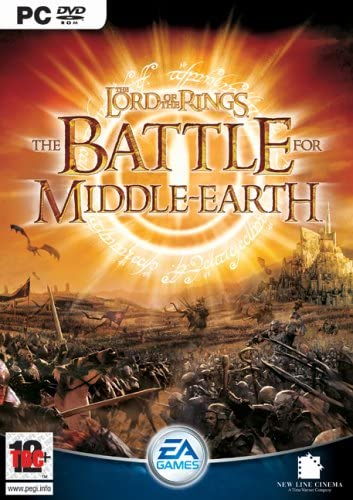

</img>

# Lord of the Rings RE

`The Battle for Middle-earth_code.exe` - Key checking binary sourced from the
Lord of the Rings Battle for Middle Earth CD.

## Program explanation

TODO: Screenshots of the program

## Initial steps

TODO: How I found the key checking logic


TODO: Below I will walk through each main section of the program


## Concat values

The program pushes all the box values onto the stack:

e.g
```
19E63C
"%s%s%s%s%s"
AAAA
BBBB
CCCC
DDDD
EEEE
```


Into --> 0x40813D (sprintf)

This returns a formatted string. If we look at the memory view we can see all the values have been concatenated

e.g.
```
"AAAABBBBCCCCDDDDEEEE"
```

## Transpose (004059d0)

### Step 1
The concat value is then passed to `0x405CB0`

This is a large method with many steps.

The first step is `0x04059d0` that seems to jumble the input around.

    AAAA BBBB CCCC DDDD EEEE
    AEDE DDBE CCCC EABB BDAA
    
    
    1234 5678 9ABC DEFG HIJK
    1JEK FG7H 9ABC I356 8D24


### Step 2
We then provide the the value `1JEK FG7H 9ABC I356 8D24` to the second function and get:

`14T3RL7A9ABC4EFGHIJK`

This one is a little more complex. Lets get nested:

#### BitMagic - Step 1

Function1_0x0405780(transposedInput, 13):

    - Takes the first 13 values (`1JEKFG7H9ABCI`)
    - 0xd is used as a loop counter


The function keeps a tally of the sum of the values

1JEKFG7H9ABCI -> 
CharCount:  0x360
DoubleCount:  0x177c


### Little Bit In-between - Step 2

The program then XORs the output of the previous function to the unknown param (`0x0001D31C`). 

The unknown param is the same regardless of the code

### ShakeThoseHips - Step 3

This function performs a lot of bit rotations

### CheckLength? - Step 4

The program loops around and checks for a null byte


## Extracted program

TODO: Once the program is fully converted to Python explain here how I found the vuln in the algorithm