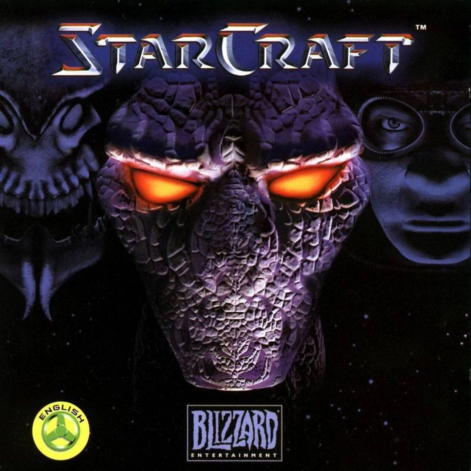
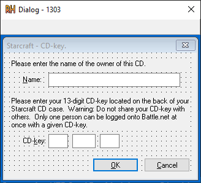
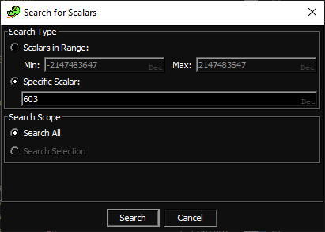

</img>

# Starcraft

## Introduction 

This RE guide will following reversing the key verification algorithm in the PC version of Starcraft.

## Recon

Starting with the biggest file `INSTALL.EXE` (`574mb`) we'll use Resource Hacker to look for signs of key verification logic.

Immediately we find what we're looking for with the following dialog saved within the resources:



After a little more inspection we can see some juicy strings:


The values here can be used to find where these strings are used.

Ghidra has functionality to search for scalars in code:



# Name validation

Using the value `603` for the string `"Invalid Name"`

This takes us to a couple of areas when the value is being pushed to the stack as a call param for `FUN_00402dd0`.

This can be abstracted as a resource loading function.

We can use Ghidra's beautiful decompiler to help us work out the Name validation. 

The following code has been extracted from Ghidra:

```C
int VALIDATE_NAME_INPUT(char* *NAME_STR, HWND RESC_PTR)
{
  if (NAME_STR == 0x0) {
    THROW_ERROR(0x57);
    return 0;
  }
  uint strLen = lstrlenA(NAME_STR);
  if (strLen == 0) {
                    /* DISPLAYS: "You must enter a name to continue with installation." */
    LOAD_RESOURCE(0x25b,0x25c,RESC_PTR);
    return 0;
  }
  if (0x1f < strLen) {
                    /* DISPLAYS: "Please enter a name that is less than 127 characters long." */
    LOAD_RESOURCE(0x25b,0x25d,RESC_PTR);
    return 0;
  }
  if (CONTAINS(NAME_STR,'\"') != 0x0) {
                    /* DISPLAYS: "Please enter a name that does not contain quotes (\")." */
    LOAD_RESOURCE(0x25b,0x25e,RESC_PTR);
    return 0;
  }
  return 1;
}
```

```
Where: 

LOAD_RESOURCE   == FUN_00402dd0
CONTAINS        == FUN_00422a80
THROW_ERROR     == FUN_0041696a
```

This validation is very standard, we cannot have a string longer than 127 and it must not contain a quote mark.

We can now do the same for the key verification

# Key validation

In the parent function (`FUN_0040f5e0`) of the previous function it then jumps to the key verification logic.

The key verification function (`FUN_0040f8a0`) is very small and performs a trivial check on the key


```C
int VALIDATE_KEY_INPUT(char* KEY_INPUT, HWND RSCS_PTR)
{
  uint uVar3;
  uint i;
  
  if (KEY_INPUT == 0x0) {
    THROW_ERROR(0x57);
    return 0;
  }
  int strLen = lstrlenA(KEY_INPUT);
  if (strLen != 0xd) {
    /* "You entered an invalid CD-Key. Please check to ensure that
    you have entered the CD-Key as it appears on the CD-case." */
    LOAD_RESOURCE(600,0x25a,RSCS_PTR);
    return 0;
  }
  uVar3 = 3;
  i = 0;
  while ((char chr = KEY_INPUT[i], '/' < chr && (chr < ':'))) {
    uVar3 = uVar3 + (uVar3 * 2 ^ (int)chr - 0x30U);
    i = i + 1;
    if (0xb < i) {
      if ((int)KEY_INPUT[0xc] != (uVar3 % 10) + 0x30) {
        /* "You entered an invalid CD-Key. Please check to ensure that
        you have entered the CD-Key as it appears on the CD-case." */
        LOAD_RESOURCE(600,0x259,RSCS_PTR);
        return 0;
      }
      return 1;
    }
  }
  
  /* "You entered an invalid CD-Key. Please check to ensure that
  you have entered the CD-Key as it appears on the CD-case." */
  LOAD_RESOURCE(600,0x259,RSCS_PTR);
  return 0;
}
```

As it can be seen the checking functionality comes down to this line:

```C
if (0xb < i) {
    if ((int)KEY_INPUT[0xc] != (uVar3 % 10) + 0x30)
[...]
```

It stops at the penultimate char and checks if the final character is equal to the final digit of the uVar3.

`uVar3 % 10` will grab the final digit of the number. I.e `1234 % 10 == 4`

And `+ 0x30` converts a numerical digit to ascii counter part. I.e. `0 + 0x30 == (0x30) | '0'`

The key functionality can be seen below represented as working Python:

```python
def valid_key(key):
    tally = 3

    for i, k in enumerate(key):

        tally = tally + (tally * 2 ^ int(k))

        if (i + 1) > 11:

            # Checks the last value of the tally
            # if that matches 
            if key[12] == str(tally % 10):
                return True
                break

    else:
        return False
```

So in summary, the key is 13 numerical digits long. 

The first 12 digits are tallied into a single value by talking the previous result, doubling it and XORing the **numerical** value of that digit.

This value produced above then has its final digit extracted and compared to the final digit of the original key. If they match we have a valid key!

# Break it

Breaking it in unbelievably simple. We compute the `tally` value of a range 12-digit number (See above). After obtaining the final value for `tally` we extract the final digit and append it to our random 12-digit value. 

Easy!