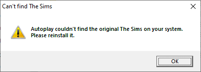
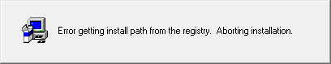
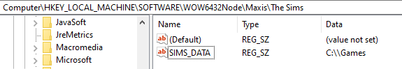
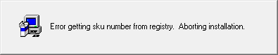
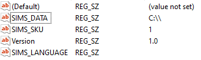

# The Sims - House Party Expansion

## Setup

Unlike other games, The Sims requires a base version to be install before any expansions can be added. We get the following message:



I don't want to pay for the base version and don't have it to hand so lets try and get to the serial key validation without it.

The `start.exe` program looks for the registry key "`HKLM\Software\WOW6432Node\Maxis\The Sims`" and two values (`SIMS_LANGUAGE` and `SIMS_SKU`), if it's found the program will continue. The check occurs in `FUN_0040d9d0`. To circumvent this check we could patch the line at `0040cd59`:

```
0040cd59 84 c0           TEST       AL,AL
```

This line essentially checks if `AL` is equal to zero, if so the program will fail. We just need to patch this line out to get past the check.

The `start.exe` spawns `Setup.exe` from the setup files. This brings us to the following menu!


However, we're given the following dialog if we attempt an install:



Our quick hack hasn't paid off. We're going to have to dig a bit deeper.

## setup.exe

The registry key checking is performed in the InstallShield script. We can reverse the logic and see what the binary is up to.

Essentially the `setup.exe` is checking for some specific registry values. The following sections describes each registry key value and how they're validated.

### SIMS_DATA

With the following code we can see the program is checking for the install path like so:

```
begin
   function_413(-2147483646);
   RegDBGetKeyValueEx("Software\\Maxis\\The Sims", "SIMS_DATA", local_number1, local_string1, local_number2);
   local_number3 = LASTRESULT;
   local_number4 = (local_number3 != 0);
   if(local_number4) then // ref index: 1
      function_360("ERROR_INSTALL_PATH");
      local_string2 = LASTRESULT;
      function_29(local_string2);
   endif;
label_83de:
   // return coming
   return local_string1;
end; // checksum: 3af2e547
```

It's looking for a path in the `SIMS_DATA` value. If we add anything there like so:



We get a different error message:



This means we've passed the check.

### SIMS_SKU:

The program also looks for the `SIMS_SKU` registry value with the following validation check:

```
StrToNum(local_number4, local_string1);
local_number5 = (local_number4 > 10);
local_number6 = (local_number4 < 1);
local_number5 = (local_number5 || local_number6);
local_number6 = (local_number4 = 5);
local_number5 = (local_number5 || local_number6);
```

This code value has to be between 1 and 10 and not 5

Adding the value: `SIMS_SKU: 1` passes the check.

### Version

The program also looks for the `Version` key with the following check:

```
local_number4 = (local_string1 != "1.0");
local_number5 = (local_string1 != "1.1");
local_number4 = (local_number4 = local_number5);
local_number5 = (local_string1 != "1.01");
local_number4 = (local_number4 = local_number5);
local_number5 = (local_string1 != "1.003");
local_number4 = (local_number4 = local_number5);
local_number5 = (local_string1 != "1.001");
local_number4 = (local_number4 = local_number5);
local_number5 = (local_string1 != "1.002");
local_number4 = (local_number4 = local_number5);
local_number5 = (local_string1 != "1.004");
local_number4 = (local_number4 = local_number5);
local_number5 = (local_string1 != "1.000");
local_number4 = (local_number4 = local_number5);
local_number5 = (local_string1 != "1.2");
local_number4 = (local_number4 = local_number5);
local_number5 = (local_string1 != "1.3");
local_number4 = (local_number4 = local_number5);
if(local_number4) then // ref index: 1
   function_360("ERROR_INVALID_VERSION_NUMBER");
   local_string2 = LASTRESULT;
   function_29(local_string2);
endif;
```

Adding the key value pair: `Version:1.0`

### SIMS_LANGUAGE

Just adding the registry key with the name `SIM_LANGUAGE` passes this check. No value is required.

### Registry Summary

In summary the registry should something like this:




## Recon

We can finally get to the actual meat of this write up. 

Once the `Setup.exe` binary is run and we enter an invalid key we get the following:


<!-- TODO: Explain in previous sections how we get the code from the setup.inx -->
This string or logic to display this popup does not seem to be embeded in a conventional way and is the case with some games the logic is handled by the InstallerShield `setup.inx` code we found earlier.


The four parts are stored in individual variables and are initialised in the following code:

```
global_string28 = "";
global_string29 = "";
global_string30 = "";
global_string31 = "";
```

Checks for the length of the values is performed in the following code:

```
StrLength(global_string28);
local_number13 = LASTRESULT;
local_number13 = (local_number13 = 4);
StrLength(global_string29);
local_number14 = LASTRESULT;
local_number14 = (local_number14 = 7);
local_number13 = (local_number13 = local_number14);
StrLength(global_string30);
local_number14 = LASTRESULT;
local_number14 = (local_number14 = 7);
local_number13 = (local_number13 = local_number14);
StrLength(global_string31);
local_number14 = LASTRESULT;
local_number14 = (local_number14 = 4);
local_number13 = (local_number13 = local_number14);
if(local_number13) then // ref index: 1
   CtrlGetSubCommand/CmdGetHwndDlg(local_string2);
   local_number9 = LASTRESULT;
   GetDlgItem(local_number9, 1); // dll: USER.dll
   local_number10 = LASTRESULT;
   EnableWindow(local_number10, 1); // dll: USER.dll
endif;
```

If all the length checks and `local_number13` == 1 then the `Next` dialog button is activated.


All the values are then combined into `local_string1` and checked against a str length of 22

```
local_string5 = (global_string28 + global_string29);
local_string5 = (local_string5 + global_string30);
local_string1 = (local_string5 + global_string31);
local_number11 = 1;
global_number36 = 1;
goto label_7463;
[...]
StrLength(local_string1);
local_number13 = LASTRESULT;
local_number13 = (local_number13 != 22);
if(local_number13) then // ref index: 1
   goto label_7781;
endif;
```

The program will then check that all the values of the key are `[0-9]`:

```
label_75d1:
   local_number5 = 0;
   local_number13 = (local_number5 <= 21);
   if(local_number13) then // ref index: 2
      local_number13 = local_string1[local_number5];
      local_number13 = (local_number13 < 48);
      local_number14 = local_string1[local_number5];
      local_number14 = (local_number14 > 57);
      local_number13 = (local_number13 || local_number14);
      if(local_number13) then
         goto label_7781; // FAIL CASE
      endif;

      local_number5 = (local_number5 + 1);
      goto label_75d1;
   endif;
```

Now, the following code section is where the validation actually occurs:

```
StrSub(local_string3, local_string1, 0, 18);
StrSub(local_string4, local_string1, 18, 4);
function_20(local_string3);
local_number6 = LASTRESULT;
StrToNum(local_number8, local_string4);
local_number13 = (local_number6 = local_number8);
if(local_number13) then // ref index: 1
   local_number4 = 1;
endif;
```

The key is split into two sections with the first two lines. `local_string3` is a  18 char string and `local_string4` is a 4 char string.

`local_string3` is chucked into `function_20` (We'll come back to this in a moment). The code will then take the result from this function and compare it to the last four digits of the key! If they match we have a valid key.

In order to crack the keys we need to run a random partial key (`[0-9]{18}`) through `function_20` and append it our random partial key. 

In summary, the following code performs the validation. `local_number4` equaling one signals a valid key.

```
local_number13 = (local_number6 = local_number8);
if(local_number13) then // ref index: 1
   local_number4 = 1;
endif;
```

### `function_20`

The best way to explain `function_20` is through code. The following python code performs the 'checksum' functionality of the algorithm. 

```python
def round(KEY, local_number8, local_number5, mod):

    key_len = len(KEY)

    local_number1 = 0

    while local_number5 < key_len:

        # This code makes a value with
        # the number of zeros of local_number8
        # i.e.
        #   > 5 = 10000
        local_number7 = 10 ** (local_number8 - 1)

        # Caps the value of "local_number11" to the key length
        temp = local_number5 + local_number8
        local_number11 = min(temp, key_len)

        local_number6 = local_number5

        while local_number6 < local_number11:

            if local_number6 >= 0:
                val = int(KEY[local_number6])
                local_number1 += val * local_number7
            
            local_number7 /= 10
            local_number6 += 1

        local_number1 = local_number1 % mod
        local_number5 += local_number8

    return int(local_number1)    

def function_20(KEY):
    assert(len(KEY) == 18)

    # Both rounds create each half of the four digit value
    r1 = round(KEY, 7, -5, 73)
    r2 = round(KEY, 5, 0, 79)

    return str(r1).zfill(2) + str(r2).zfill(2)
```