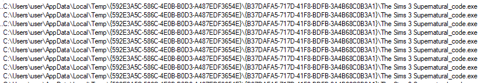
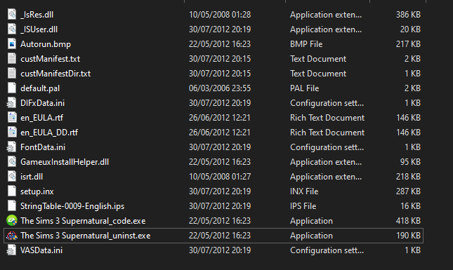
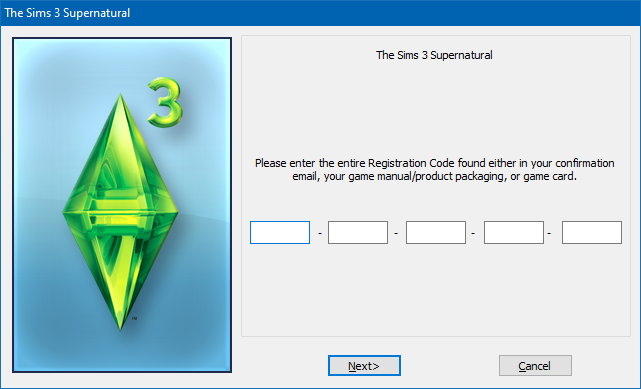
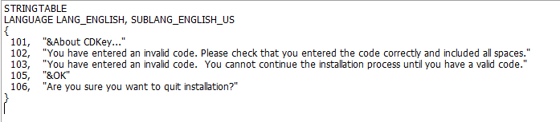
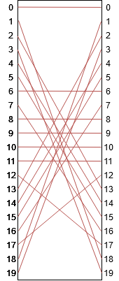

</img>

# The Sims 3 - Supernatural

## Introduction
This guide will walk through the reversing of the serial key validation of "The Sims 3 - Supernatural" released in September, 2012.

## Recon

### InstallerShield

What initially stood out from the games files was the `setup.inx` file in the root directory. This tells us the game is using InstallerShield as this file contains the install logic. 

As experience with other games would suggest, reversing code extracted from these files is a straight forward experience. Therefore, it is a good place to start.

However, in this case no key verification logic is handled in the installer's logic. 

### Procmon

After running the program and looking at it's results in Procmon, it became apparent the installer was writing to the following binary to a temporary directory:



With the following files:



This is the same format as the standalone Lord of the Rings: Battle for Middle Earth (another early EA game) key verification binary. So this was of interest!

This differs from LOTR as the binary was extracted from the installer instead of being present in a readable directory (`/Support` in the case of LOTR)

We have, therefore, found the key validation binary: `The Sims3 Supernatural_code.exe`. It shows us the following screen:




This binary when checked into ResourceHacker gives us some interesting strings:



We can use these values to search in Ghidra (`Search -> For Scalars`). This takes us to the function: `UndefinedFunction_00404f9e` (`FUN_00404f9e`).

`FUN_00404f9e` has the following hot spot:
```c
[..]
    cVar2 = FUN_00407cb0(KEY, key_length);
    cStack2589 = '\0';
    if (cVar2 != '\0') goto LAB_00405075;
  }
  cStack2589 = '\x01';
LAB_00405075:
  if ((uStack2596 & 1) != 0) {
    FUN_00401bb0(abStack2624,'\x01',0);
  }
  if (cStack2589 == '\0') {
    EndDialog(param_1,1);
    FUN_00405aac(
        u_Sims_0043b1c0, 
        u_The_Sims_3_Supernatural_0043b2c8, 
        auStack528,
        param_1 + 0x80,
        param_1 + 0x74
    );
  }
  else {
    if (TIMES_KEY_ENTERED == 0) {
        /* DISPLAYS: "You have entered an invalid code.  You cannot continue the installation process until you have a valid code." */
    }
    else {
         /* DISPLAYS: "You have entered an invalid code. Please check that you entered the code correctly and included all spaces." */
    }
    FUN_00405aac(
        u_Sims_0043b1c0,
        u_The_Sims_3_Supernatural_0043b2c8,
        &DAT_0042f500,
        param_1 + 0x80,
        param_1 + 0x74
    );
    TIMES_KEY_ENTERED = TIMES_KEY_ENTERED + -1;
  }
[...]
```

The key area is the check: `if (cStack2589 == '\0') ...`, this is the variable that states if the key is valid. If it's not we'll get some angry error messages.

If we work our way back, `cStack2589` is essentially determined by the result of the function: `FUN_00407cb0`. This can be seen below:

```c
[...]
    cVar2 = FUN_00407cb0(KEY, key_length);
    cStack2589 = 0;
    if (cVar2 != 0) goto LAB_00405075;
  }
  cStack2589 = '\x01';
LAB_00405075:
[...]
```

## FUN_00407cb0

The function starts off by populating some memory. The following pseudo code displays the logic (`FUN_004078d0` does some XOR and shifts). All of the memory is contained within `DAT_0043dd18`.

```c
if (MEMORY_POPULATED? == false) {
   uVar2 = 0;
   do {
     uVar2 = FUN_004078d0(uVar2);
     (&DAT_0043dd18)[extraout_ECX] = uVar2;
     uVar2 = extraout_ECX + 1;
   } while (uVar2 < 0x100);
   MEMORY_POPULATED? = true;
}
```

The generated memory is actually exactly the same as the one used in the LOTR key validation

The following functionality of `FUN_004078d0` can summarised like so:

```
- Transpose(key)                        (`FUN_00407b30`)
    --> t_key

- Tally(t_key[:13])                     (`FUN_00407870`)
    --> tally_output

- Shift_1(SEED ^ tally_output)          (`FUN_00407990`)
    --> S1 

- Update_Seed(t_key[:13] + S1)          (`FUN_00407950`)
    --> U_SEED 

- Shift_2(U_SEED)                       (`FUN_00407a60`)
    --> S2

- Transpose(key[:13] + S2)              (`FUN_00407b30`)
    --> FINAL_KEY
```

All but the initial seed and a single line in Shift_2 are exactly the same as LOTR.

## Transpose (`FUN_00407b30`)

The best way to demonstrate this function is visually. The following image shows how the indies of a key (20 characters in length) get moved around:



This is a reversible function, applying it once then once again will reverse the affect of the first.

## Tally (`FUN_00407870`)

TODO

## Shift_1 (`FUN_00407990`)

TODO

## Update_Seed (`FUN_00407950`)

TODO

## Shift_2 (`FUN_00407a60`)

TODO


## Validate

TODO: Talk here how the key is actually validated

## Titbits

https://www.games4theworld.club/t21087-how-to-skip-ea-electronic-registration-ergc-during-install#